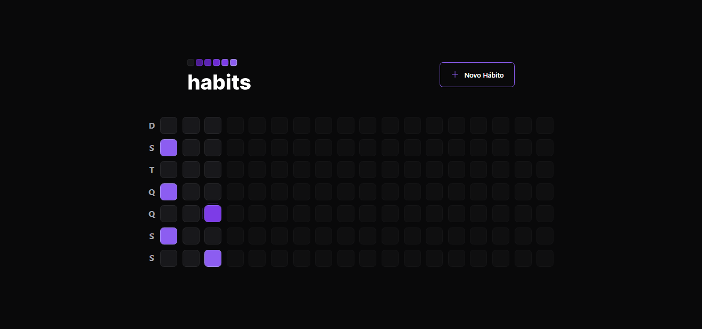
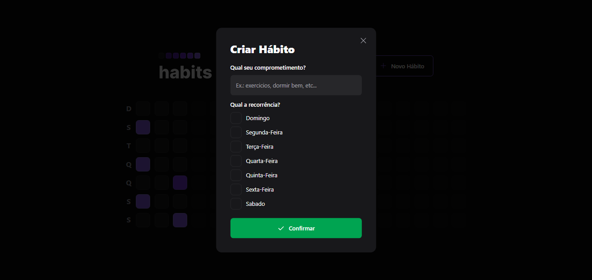
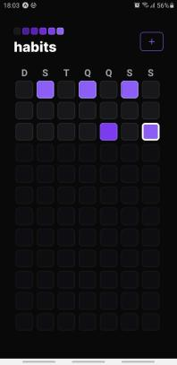
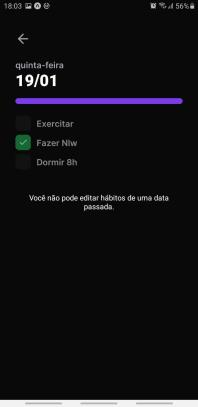

<h1 align="center"> NLW Setup </h1>

Evento exclusivo e gratuito, promovido pela Rocketseat para ensino de tecnologias WEB.

  <a href="#-tecnologias">Tecnologias</a>&nbsp;&nbsp;&nbsp;|&nbsp;&nbsp;&nbsp;
  <a href="#-projeto">Projeto</a>&nbsp;&nbsp;&nbsp;|&nbsp;&nbsp;&nbsp;
  <a href="#memo-licença">Licença</a>

<!--

  

-->

 

<table>
  <tr>
    <td valign="center">
      
    </td>
    <td valign="center">
      
    </td>
  </tr>
  <tr>
    <td valign="center">
      
    </td>
    <td valign="center">
      
    </td>
  </tr>
</table>

## 🚀 Tecnologias

Esse projeto foi desenvolvido com as seguintes tecnologias:

- React -> Front-end
- tailwind -> css
- [Vite](https://vitejs.dev/)
- Typescript -> Back-end, Front-end, Mobile
- Prisma -> ORM
- SQLite -> Banco de dados
- React Native -> Mobile

## 💻 Projeto

O Habit é um programa em que o usuário cadastra habitos para serem realizados durante a semana.

Você pode:
  - Visualizar as tarefas do dia atual ou anterior
  - Cadastrar novo hábito
  - Marcar ou desmacar tarefas completadas daquele dia

## :memo: Licença

Esse projeto está sob a licença MIT.

---

Feito com ♥ by Rocketseat :wave: [Participe da nossa comunidade!](https://discord.gg/rocketseat)
